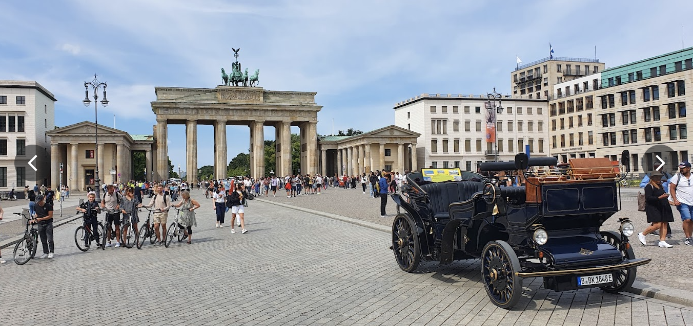
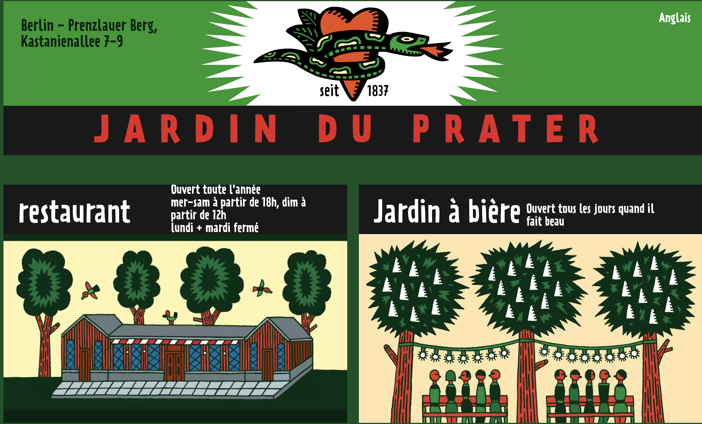

# 🌞 Proposition La Porte de Brandebourg et tour de vélo / soirée 

- ♾️ Visite et trajet vélo 4h 
- ♾️ détente et repas ♾️ 

### La Porte de Brandebourg 

🚀 Temps : 1h

1. **Histoire :** Construite à la fin du 18e siècle dans le style néoclassique, la Porte de Brandebourg a été commandée par le roi de Prusse, Frédéric-Guillaume II, et conçue par l'architecte Carl Gotthard Langhans. Elle était à l'origine une porte d'entrée de la ville et un symbole de paix.
   
1. **Symbolisme :** La Porte de Brandebourg a été le témoin de nombreux événements historiques majeurs, de la division de l'Allemagne à la chute du mur de Berlin en 1989. Aujourd'hui, elle incarne l'unité allemande et est un symbole de la réunification du pays.

##  Contexte:

### Histoire :

1. **Construction :** La Porte de Brandebourg a été construite entre 1788 et 1791 sur l'ordre du roi de Prusse Frédéric-Guillaume II. 

L'architecte Carl Gotthard Langhans a conçu ce monument dans un style néoclassique.

2. **Porte d'entrée de la ville :** À l'origine, la Porte de Brandebourg était l'une des nombreuses portes d'entrée de la ville de Berlin. Elle était située à la frontière entre la ville et la zone de chasse royale, symbolisant l'entrée dans la ville.

### Symbolisme et événements historiques :

1. **Symbole de paix :** La Porte de Brandebourg a été conçue comme un symbole de paix et de prospérité. Le quadrige au sommet de la porte représente la déesse de la victoire, conduisant un chariot.

2. **Division de l'Allemagne :** Après la Seconde Guerre mondiale, la Porte de Brandebourg est devenue un symbole de la division de l'Allemagne, étant située dans la partie est de la ville, alors que Berlin était divisée entre l'Est et l'Ouest.

3. **Chute du mur de Berlin :** En 1989, la Porte de Brandebourg est devenue le symbole de la réunification allemande lorsque le mur de Berlin, qui passait juste à côté, a été ouvert. Des milliers de personnes ont célébré la chute du mur autour de la Porte de Brandebourg.

### Après la réunification :

1. **Renouveau :** Depuis la réunification de l'Allemagne, la Porte de Brandebourg est devenue un symbole important de l'unité allemande et de la liberté.
   
2. **Restauration :** Au fil des ans, la Porte de Brandebourg a été restaurée et rénovée pour maintenir sa splendeur historique. Elle est aujourd'hui l'un des monuments les plus photographiés de Berlin.

## Idée d'itinéraire à vélo

### Résumé de l'itinéraire 

🚀 Temps : 3h

1. Départ : Alexanderplatz
2. Direction sud le long de l'avenue Unter den Linden
3. Arrivée : **Porte de Brandebourg**
4. Pause (rapide) au parc Tiergarten
5. Visite du Reichstag et du mémorial de l'Holocauste
6. Retour : Alexanderplatz
7. Détente dans les bars et restaurants locaux

### 🌀 Détails des étapes 🌀

1. **Départ de la tour de télévision (Fernsehturm) :** Commencez votre journée à vélo à Alexanderplatz, où se trouve la célèbre tour de télévision. Admirez la vue sur la ville depuis la place avant de vous diriger vers la Porte de Brandebourg.

2. **Direction la Porte de Brandebourg :** Enfourchez votre vélo et dirigez-vous vers le sud en longeant l'avenue Unter den Linden. Vous passerez devant de nombreux bâtiments historiques et monuments, y compris l'Opéra d'État de Berlin et l'université Humboldt.

3. **Arrivée à la Porte de Brandebourg :** Une fois arrivé à la Pariser Platz, vous verrez la majestueuse Porte de Brandebourg devant vous. Prenez le temps d'admirer ce monument emblématique et prenez quelques photos pour immortaliser votre visite.

4. **Faites une pause au parc Tiergarten :** Après avoir visité la Porte de Brandebourg, dirigez-vous vers l'ouest en traversant le parc Tiergarten. Ce grand parc offre de nombreux sentiers pittoresques où vous pourrez vous détendre et profiter de la nature au cœur de la ville.

5. **Reichstag et mémorial de l'Holocauste :** Continuez votre balade à vélo en direction du Reichstag, le parlement allemand. Vous pourrez admirer son architecture impressionnante et peut-être même réserver une visite guidée à l'intérieur. À proximité se trouve également le mémorial de l'Holocauste, un lieu de mémoire important à ne pas manquer.

6. **Retour à Alexanderplatz :** Après avoir exploré la région autour de la Porte de Brandebourg, du Reichstag et du parc Tiergarten, vous pouvez revenir à votre point de départ à Alexanderplatz. Profitez-en pour vous arrêter dans l'un des nombreux cafés ou restaurants pour vous détendre après votre balade à vélo.

### 🫒 Soirée (quelques idées) 🫒

🥹 

1. **Berghain / Panorama Bar :** Ce célèbre club berlinois est réputé pour sa musique électronique de qualité et son ambiance unique. Attendez-vous à une sélection musicale variée et à une atmosphère immersive. Notez que l'entrée peut être sélective. 🍅 [Khanate](https://www.berghain.berlin/en/event/77886/)

2. **Watergate :** Situé le long de la rivière Spree, le Watergate est un club réputé pour ses soirées animées et ses DJ de renommée internationale. Vous pourrez danser toute la nuit tout en profitant d'une vue magnifique sur la ville depuis sa terrasse. 🍅 [watergate](http://water-gate.de/de/club/2024_kw17/akronym.html)

3. **Kater Blau :** Niché sur les rives de la Spree, le Kater Blau offre une ambiance détendue avec plusieurs pistes de danse, des jardins en plein air et une programmation musicale éclectique allant de la house à la techno.

4. **Yaam :** Si vous préférez une ambiance plus décontractée, le Yaam est l'endroit idéal. Ce club en bord de plage propose souvent des concerts en direct mettant en vedette des artistes locaux et internationaux, ainsi qu'une délicieuse cuisine jamaïcaine. 🍅 [Yaam](https://yaam.de/)

5. **Sisyphos :** Ce club alternatif est réputé pour ses fêtes spontanées et sa programmation musicale variée, allant de la techno à l'indie. Vous y trouverez également des installations artistiques fascinantes et une ambiance communautaire.

6. **Prater Garten :** Si vous recherchez quelque chose de plus tranquille, Prater Garten est l'un des plus anciens jardins de bière de Berlin. Profitez de l'ambiance détendue, sirotez une bière locale et savourez des plats allemands classiques tout en écoutant de la musique live certains soirs. 🍅 [Prater Garten](https://www.pratergarten.de/)
