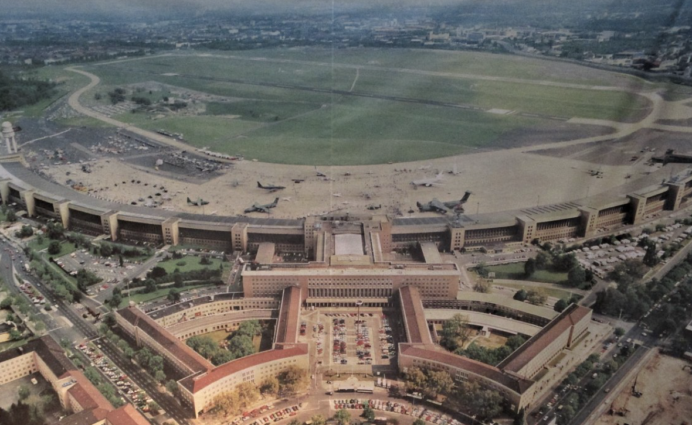
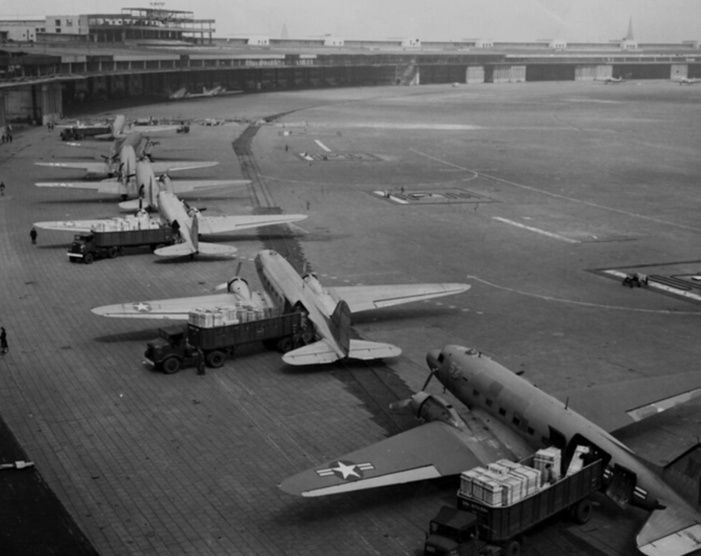

# Pont aérien 

🥶 Pendant la guerre froide, Berlin a été au cœur des tensions entre les superpuissances occidentales et l'Union soviétique. 

Résumé de l'histoire de Berlin pendant cette période, en mettant en lumière le pont aérien :small_airplane 🛩️ 

### Contexte de la Guerre froide :

Après la Seconde Guerre mondiale, l'Allemagne a été divisée en zones d'occupation contrôlées par les Alliés : les États-Unis, le Royaume-Uni, la France et l'Union soviétique. 

🌇 Berlin, bien que située dans la zone soviétique, a été également divisée en secteurs occupés par les différentes puissances alliées.

### Blocus de Berlin et le pont aérien :

En juin 1948, les Soviétiques ont imposé un blocus terrestre à Berlin-Ouest, contrôlé par les Américains, les Britanniques et les Français, dans le but de forcer les Alliés à abandonner la ville. 

Les routes, les voies ferrées et les canaux reliant Berlin-Ouest à l'Allemagne de l'Ouest ont été coupés.

### Le pont aérien

Face à ce blocus, les Alliés ont répondu en organisant un pont aérien massif pour approvisionner la population de Berlin-Ouest en nourriture, en carburant et en autres fournitures essentielles. 

🚀 Le 26 juin 1948, les premiers avions transportant des vivres ont atterri à l'aéroport de Tempelhof( Tempelhof-Schöneberg à Berlin)

### Opération Vittles :

Surnommée "Opération Vittles" par les Américains 🇺🇸 et "Rosinenbomber" (les "bombardiers de raisins secs") par les Allemands, cette opération a impliqué des centaines de vols par jour, avec des avions décollant toutes les quelques minutes. C'était un exploit logistique remarquable, mettant en œuvre des avions cargo comme le C-47 et le C-54.

### La fin du blocus :

Face à l'efficacité du pont aérien et à la détermination des Alliés, l'Union soviétique a finalement levé le blocus en mai 1949. Le pont aérien a été maintenu pendant plusieurs mois après la fin du blocus pour reconstruire les réserves de la ville.

### Importance du pont aérien :

Le pont aérien de Berlin est devenu un symbole de la détermination occidentale face à l'agression soviétique et de la solidarité envers les Berlinois assiégés. Il a renforcé les liens entre l'Allemagne de l'Ouest et ses alliés occidentaux et a contribué à façonner la perception de la Guerre froide.

## Idée d'itinéraire

Voici un itinéraire à vélo pour visiter l'aéroport de Tempelhof, avec des arrêts pour des visites culturelles et des restaurants sympas :

### Itinéraire à vélo :

1. **Départ : Alexanderplatz**
   -  Alexanderplatz, au cœur de Berlin.

2. **Direction sud vers le Checkpoint Charlie :**
   - Direction Kreuzberg et Friedrichshain.
   - Pause au Checkpoint Charlie pour découvrir l'histoire de la division de Berlin.

3. **Traversée de la Spree :**
   - Traversez la rivière Spree pour rejoindre le quartier de Tempelhof.

4. **Visite de l'aéroport de Tempelhof :**
   -  🚀 Aéroport de Tempelhof découverte son histoire fascinante en visitant le musée situé à l'intérieur.

5. **Balade dans le parc Tempelhofer Feld :**
   - Balade à vélo ou à pied dans le parc Tempelhofer Feld, l'ancienne piste d'atterrissage de l'aéroport transformée en espace vert public. 🌳 

6. **Pause déjeuner :**
   - Déjeuner dans l'un des nombreux cafés ou restaurants situés à proximité du parc. 

7. **Retour :**
   - Retour versentre-ville de Berlin en suivant un itinéraire panoramique le long de la Spree ou en traversant les quartiers résidentiels de Kreuzberg et Mitte. 🍉

### Points forts culturels 

1. **Checkpoint Charlie Museum :**

2. **Aéroport de Tempelhof :**

## Idées de restaurants durant la balade

Parc Tempelhofer Feld 

1. **Mogg & Melzer Delicatessen :** Niché dans une ancienne boulangerie juive, ce restaurant offre une atmosphère unique avec son décor vintage et son menu créatif. Vous pourrez déguster des sandwichs à la viande fumée, des bagels maison et d'autres spécialités juives revisitées avec une touche moderne.

1. **Café Restaurant Jolesch :** Ce restaurant autrichien offre une expérience unique avec sa décoration traditionnelle et son ambiance chaleureuse. Vous pourrez déguster des plats autrichiens authentiques, tels que le schnitzel viennois ou le goulasch, dans une atmosphère conviviale.

🥫 [Jolesch](https://jolesch.de/en/restaurant/) 🥫

1. **Henne Alt-Berliner Wirtshaus :** Situé dans le quartier de Kreuzberg, ce restaurant traditionnel berlinois propose des plats typiques de la cuisine allemande, notamment le célèbre poulet frit (Hühnerfrikassee). L'ambiance est rustique et pleine de caractère, parfait pour une expérience authentique.

[Alt-Berliner Wirtshaus](https://www.facebook.com/DieHenneBerlin/)

